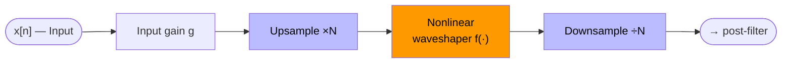
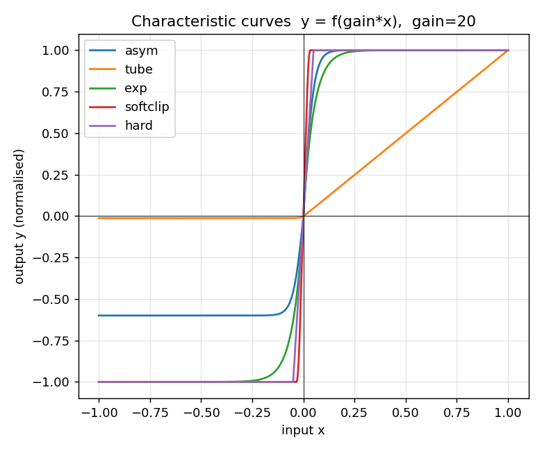
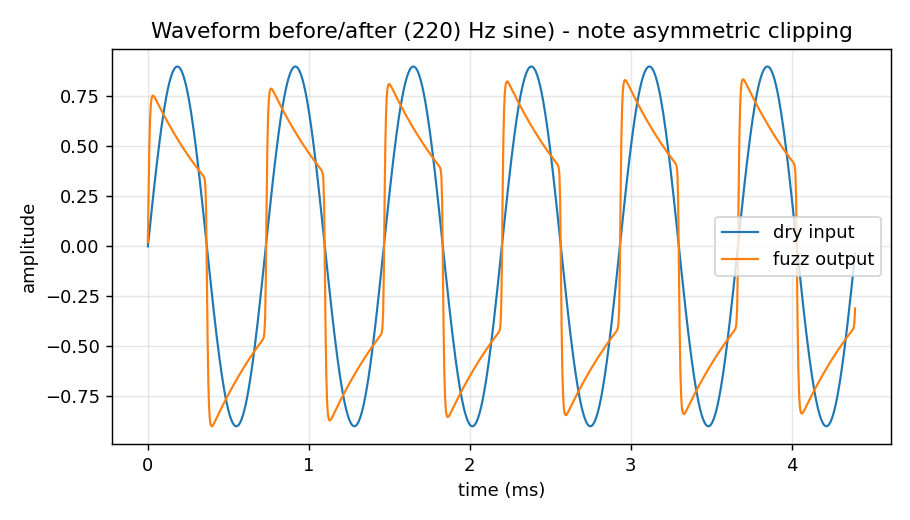
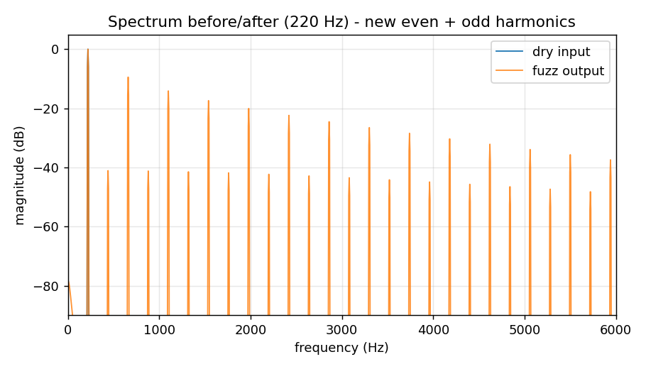
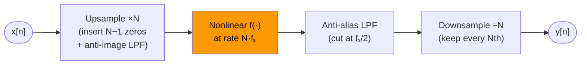
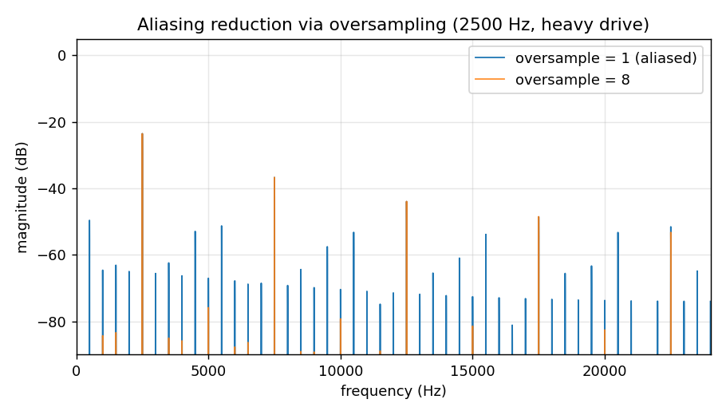

# The Fuzz Face Effect — Implementation Report

**Course:** Digital Signal Processing (0512.4200), Semester A 2025–2026
**Assigned effect:** Fuzz Face

---

## Introduction

Jimi Hendrix (1942–1970) is widely regarded as the most influential electric guitarist in history.
In the span of just four years of recording — from *Are You Experienced* (1967) to *Band of Gypsys*
(1970) — he redefined what the guitar could sound like, blending blues expressiveness with
psychedelic experimentation and raw power. His tone was inseparable from his technique: aggressive
picking, whammy-bar manipulation, feedback, and, above all, heavy use of fuzz distortion.

The pedal at the centre of that sound was the **Dallas Arbiter Fuzz Face**, a compact germanium
transistor circuit introduced in 1966. Hendrix ran it at the front of his signal chain, feeding
a cranked Marshall stack, to produce the dense, sustaining, almost vocal fuzz heard on tracks such
as *Purple Haze*, *Foxey Lady*, and *Manic Depression*. The circuit's two germanium transistors
clip the audio waveform **asymmetrically** — the positive and negative half-cycles saturate at
different levels — which generates a rich mix of both even- and odd-order harmonics. That harmonic
content is what gives the Fuzz Face its distinctive warmth and "bloom": notes swell, sustain far
beyond their natural decay, and acquire a throaty, singing quality that no later solid-state or
digital distortion has fully replicated.

This report documents a digital implementation of the Fuzz Face effect, covering the perceptual
qualities of the sound, the underlying DSP signal chain, the mathematical models used, and the
design decisions made during implementation.

---

## 1. What the effect does (the sound)

The Fuzz Face is a classic guitar **fuzz** pedal — the aggressive, saturated tone
heard on much of Jimi Hendrix's playing. Perceptually it transforms a clean,
dynamic input into a thick, buzzy, *sustaining* tone. Two qualities define it:

- **Sustain / compression.** The effect clips the waveform toward a near-square
  shape, so quiet parts are lifted and loud parts are limited. Notes appear to
  "bloom" and ring on far longer than the dry signal. Measured on the supplied
  samples, the crest factor (peak-to-RMS) collapses from 18.4 dB to 7.2 dB for
  `speechshort` and from 30.2 dB to 16.4 dB for `casta` — i.e. the dynamics are
  strongly compressed, which the ear hears as sustain and "thickness".
- **Harmonic richness with a vocal character.** Because the clipping is
  **asymmetric**, the output contains both **even- and odd-order harmonics**
  (Figure 3). The even harmonics give the Fuzz Face its slightly hollow, vocal
  colour that distinguishes it from purely symmetric distortions. It works best
  on single notes; on full chords the same nonlinearity also produces
  inharmonic intermodulation tones, which is why fuzz is most often used for
  lead lines and power chords.

---

## 2. How it works (the DSP)

### Signal flow

**Stage 1 — nonlinear distortion path:**

**Stage 2 — post-filtering and mix:**

**Nonlinear waveshaping.** The heart of any distortion/fuzz is a *memoryless*
nonlinearity — each output sample depends only on the current input sample:

$$y[n] = f\!\left(g \cdot x[n]\right)$$

Unlike linear effects (filters, delays), a nonlinearity creates **new**
frequency components not present in the input. The input gain $g$ sets how hard
the signal is pushed into the nonlinear region — more gain means more distortion
and more sustain, while output amplitude barely changes because the curve saturates.

---

### Asymmetric clipping — the Fuzz Face model

The implemented default model soft-clips both half-waves with a $\tanh$ curve,
but saturates the **negative** half-wave at a lower level (parameter
$\alpha$, default $\alpha = 0.6$):

$$f(x) = \begin{cases} \tanh(g\,x) & \text{if } \tanh(g\,x) \geq 0 \\ \alpha \cdot \tanh(g\,x) & \text{if } \tanh(g\,x) < 0 \end{cases}$$

This mirrors the real analog circuit, where *"the negative clipping level is lower
than the positive clipping value"* (Zölzer, *DAFX*, §4.3.2). The asymmetry is
exactly what produces **even** harmonics: an odd-symmetric function
$f(-x) = -f(x)$ can only generate odd harmonics, so breaking symmetry is
required to obtain the even harmonics audible in Figure 3.

The transfer curve is shown in Figure 1 alongside other models for comparison.

 
<em>Figure 1 — Characteristic curves. The <code>asym</code> Fuzz Face curve clips the
positive half-wave at +1 and the negative at −α = −0.6;
symmetric models clip both equally.</em>

---

### Post-filtering

Asymmetric clipping introduces a DC offset; it is removed by a second-order
**DC-blocking high-pass** that reproduces the AC coupling of the analog pedal:

$$H_{\text{HP}}(z) = \frac{1 - 2z^{-1} + z^{-2}}{1 - 2r_h\,z^{-1} + r_h^2\,z^{-2}}, \qquad r_h = 0.995$$

A first-order **tone low-pass** then tames the harshest high-frequency content:

$$H_{\text{LP}}(z) = \frac{1 - r_l}{1 - r_l\,z^{-1}}, \qquad r_l = 0.5$$

The combined filtering gives the output its characteristic asymmetric shape (Figure 2).

 
<em>Figure 2 — A 300 Hz sine before and after the effect. The output is clipped
asymmetrically (positive and negative peaks limited differently) and AC-coupled.</em>

---

### Harmonic generation

Figure 3 shows the spectrum of a 220 Hz sine before and after processing.
The single input tone becomes a full harmonic series at every integer multiple
of 220 Hz, with both even and odd harmonics present — the spectral signature of
asymmetric distortion. For a nonlinear function $f$ applied to a sinusoid
$x(t) = \sin(\omega t)$, the output can be expressed as a Fourier series:

$$f(x(t)) = \sum_{k=0}^{\infty} a_k \sin(k\omega t + \phi_k)$$

An odd-symmetric function produces only odd $k$; breaking symmetry (as the Fuzz
Face does) introduces non-zero $a_k$ for even $k$ as well — the musical
"warmth" and "vocal" quality of the pedal.

 
<em>Figure 3 — Spectrum before/after. New harmonics appear at all integer multiples
of the fundamental (even + odd), confirming asymmetric nonlinear distortion.</em>

---

### Aliasing and oversampling

A nonlinearity generates *infinitely many* harmonics. Any harmonic above the
Nyquist frequency $f_s/2$ folds back into the audible band as inharmonic,
non-removable noise. This aliasing is suppressed by **oversampling**:

The first aliased harmonic now appears above $N \cdot f_s / 2$ instead of $f_s/2$,
and its amplitude is greatly reduced because harmonic magnitudes decay with
frequency. Figure 4 contrasts $N = 1$ and $N = 8$ for a heavily driven 1837 Hz
tone: without oversampling the spectrum fills with a dense "grass" of inharmonic
aliased components, while $8\times$ oversampling leaves a clean harmonic series.

 
<em>Figure 4 — Heavy drive on a non-divisor fundamental (48 000 / 1837 ≈ 26.1).
<code>oversample=1</code> (dark) produces dense inharmonic aliasing; <code>oversample=8</code> (turquoise) is clean.</em>

---

## 3. Implementation choices

- **Language / libraries:** Python with NumPy (vectorised waveshaping),
  SciPy (`resample_poly` for oversampling, `lfilter` for the filters), and
  `soundfile` for 24-bit WAV I/O. The DSP is a pure function (`process`)
  independent of file I/O.
- **Model and parameters:** the default is the asymmetric $\tanh$ clip with
  $g = 20$, $\alpha = 0.6$ — chosen to give an obviously fuzzy, sustaining tone
  with clear even harmonics on the supplied samples. The DAFX Eq. 4.13 asymmetric
  curve is also implemented (`--model tube`); it gives a milder, preamp-like
  asymmetry because it leaves the positive half-wave nearly linear.
- **Normalisation:** input is normalised by its peak before the gain stage so $g$
  behaves consistently regardless of input level; output is peak-normalised, restored
  to the input's peak level, and hard-limited to $[-1, 1]$ to prevent clipping.
- **Oversampling factor:** $N = 8$ by default — a good trade-off between alias
  suppression and CPU cost; selectable via `--oversample` (use $N = 1$ to hear
  the aliasing for comparison).
- **Robustness:** the `tube` model's $0/0$ singularity at the work point $Q$ is
  replaced by its analytic limit $1/\text{dist}$; `exp()` arguments are clamped
  to avoid overflow at very high drive; mono/stereo and silent inputs are all
  handled, and the input sample rate and bit depth are preserved on output.

---

## References

1. U. Zölzer (ed.), *DAFX: Digital Audio Effects*, 2nd ed., Wiley, 2011 —
   Ch. 4 "Nonlinear processing", §4.3.1–4.3.2 (valve simulation, overdrive /
   distortion / fuzz, Fuzz Face; Eqs. 4.13–4.15).
2. J. D. Reiss & A. P. McPherson, *Audio Effects: Theory, Implementation and
   Application*, CRC Press, 2015 — Ch. 7 "Overdrive, Distortion, and Fuzz"
   (characteristic curves, hard/soft clipping, symmetry & harmonics, aliasing
   and oversampling, filtering).
